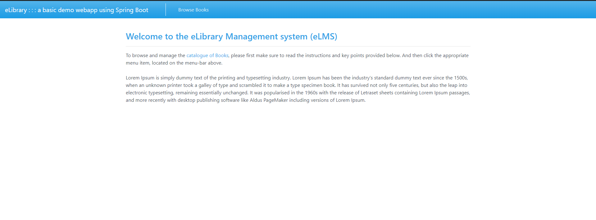

# Part 1: E-library portal
Please check the repo.
# Part 2: Spring and Spring Boot Questions

### What is Spring?
"The Spring Framework provides a comprehensive programming and configuration model for modern Java-based enterprise applications - on any kind of deployment platform.
A key element of Spring is infrastructural support at the application level:
Spring focuses on the "plumbing" of enterprise applications so that teams can focus on application-level business logic,
without unnecessary ties to specific deployment environments."
Official Spring IO website.
https://spring.io/projects/spring-framework

### What is Spring Boot?

It is a framework built over spring to simplify the development of Spring-based application.
It provides a number of features that make it easier to create standalone, production ready
application such as: Auto-configuration, Start dependencies, Embedded servers, metrics and health checks.

### What is the relation between Spring platform and Spring Boot?

Spring Boot is an opinionated way of building Spring applications with focus on quick development and production.
You can think of it as a tool within Spring platform. Spring platform or ecosystem however is a set of 
different aspects that are involved in crafting and building enterprise java applications.

### What is the relation between Spring platform and Spring framework?

Spring platform includes all spring core features and projects and spring framework is part of it.
With spring framework it is possible to include other features from spring platform into the building of a java
enterprise application.

### What is Dependency Injection and how is it done in the Spring platform/framework?

A mechanism that allows auto creation of objects and managing them through IoC and later on inject them 
to the components depending on those objects and services. We can say it is a final stage of IoC when the creation
of objects finishes then an injection happens the operation or mechanism here called DI.

### What is Inversion of Control (IoC) and how is it related to Spring?

It is a design principle where the control of object creation and management is shifted from application to an external container 
or framework. Traditionally a class is responsible for creating and managing objects and its dependencies. With IoC, this operation
is delegated to a container or a framework, in Spring, this is done through Spring container.

